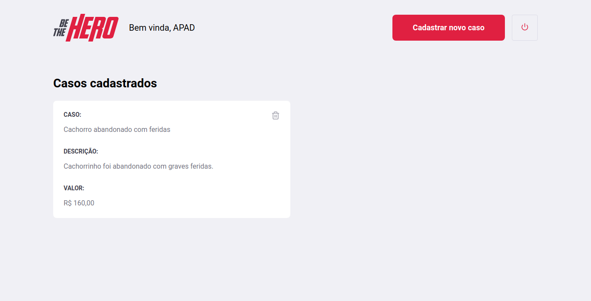
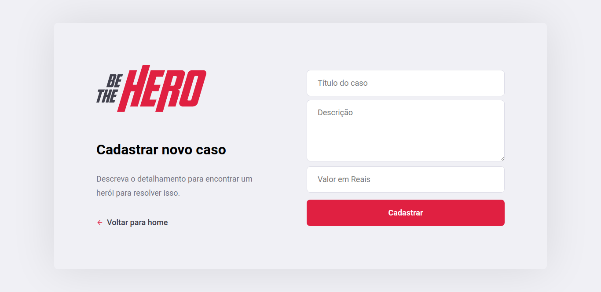
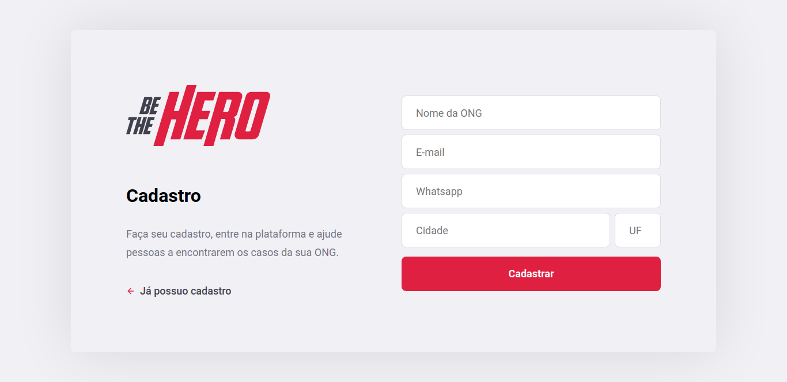

  

# SemanaOministack11

## About this Project

The idea of the App is:

_"The objective of the project is to create a website and application for NGOs that need cash aid so that their "cases" can be attended to based on Omnistack Week by [Rockeseat](https://rocketseat.com.br/)"._

## Why?

This project is part of my personal portfolio, so, I'll be happy if you could provide me any feedback about the project, code, structure or anything that you can report that could make me a better developer!

Email-me: harrisonhenrisn@gmail.com

Connect with me at [LinkedIn](https://linkedin.com/in/harrison-henri-dos-santos-nascimento-a6ba33112).

Also, you can use this Project as you wish, be for study, be for make improvements or earn money with it!

It's free!

## Functionalities

- Login 

- Cases list

- Create new case

- Register new ONG

## Built With

- [React](https://github.com/facebook/react) - Build the web app using JavaScript and React
- [React-navigation](https://github.com/react-navigation/react-navigation) - Routing and navigation for your React Native apps
- [React-native](https://github.com/expo/react-native) - Build the native app using JavaScript and React
- [React-icons](https://react-icons.github.io/react-icons/)
- [Expo](https://github.com/expo/expo) - An open-source platform for making universal native apps with React
- [Router](https://github.com/ReactTraining/react-router) - Routers
- [Knex](https://github.com/knex/knex) - Query builder for SQL
- [Axios](https://github.com/axios/axios) - HTTP Client
- [Express](https://github.com/expressjs/express)
- [Mongoose](https://github.com/Automattic/mongoose) - ODM
- [ESlint](https://eslint.org/) - Linter
- [Prettier](https://prettier.io/) - Code Formatter
- [Babel](https://babeljs.io/) - JavaScript Compiler

## Contributing

You can send how many PR's do you want, I'll be glad to analyse and accept them! And if you have any question about the project...

Email-me: harrisonhenrisn@gmail.com

Connect with me at [LinkedIn](https://linkedin.com/in/harrison-henri-dos-santos-nascimento-a6ba33112).

Thank you!
